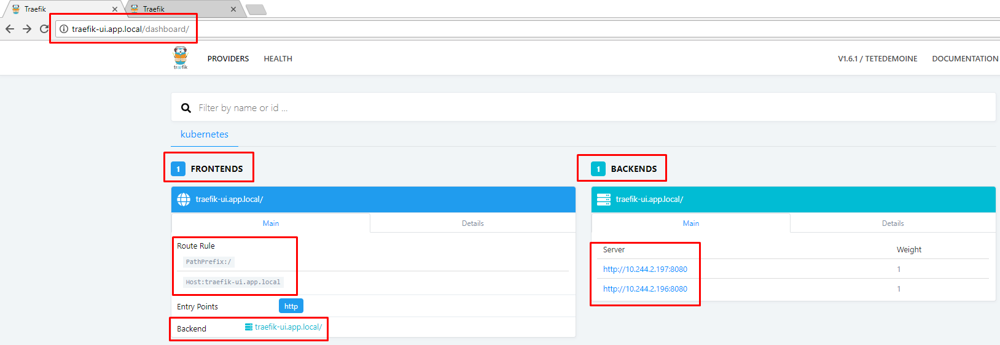
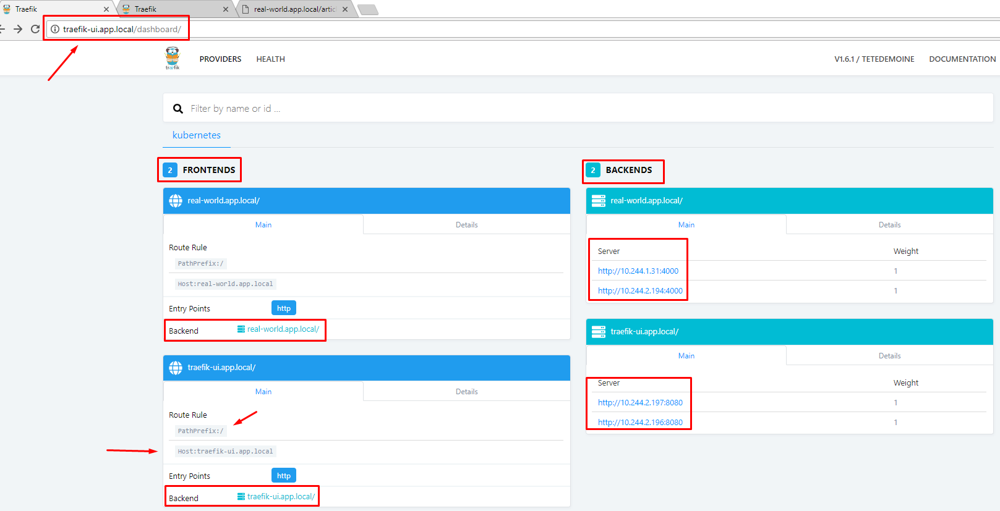
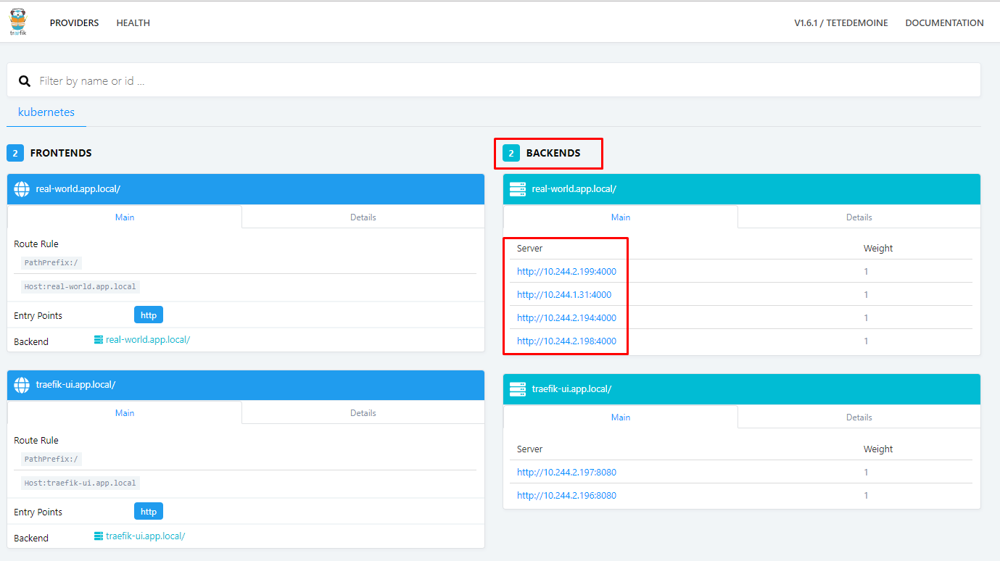
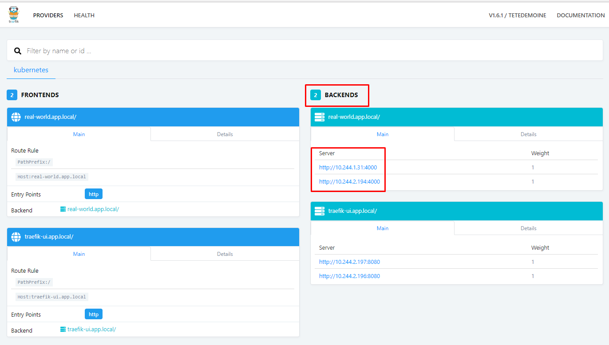
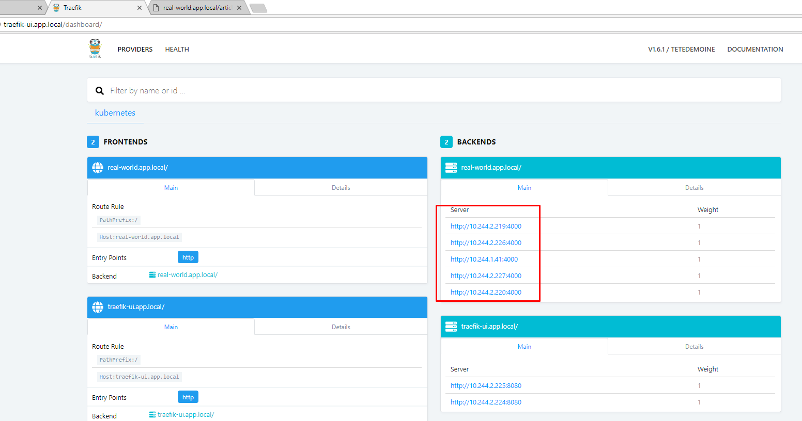

# Real World App – Elixir + Phoenix 

This document intends to exemplify the use of a Real World App running on top of Docker.
The source of this application can be found at <a href="https://github.com/gothinkster/elixir-phoenix-realworld-example-app"> GoThinkster</a>.

### Prerequisites

These examples assumes you already have a setup of: 

-	<a href="https://docs.docker.com/install/">Docker</a>
-	<a href="https://kubernetes.io/docs/setup/pick-right-solution/"> K8s </a>
-	<a href="https://prometheus.io/docs/prometheus/latest/installation/"> Prometheus </a>

### Getting Started

You can get Real World App here:
```
git clone https://github.com/gothinkster/elixir-phoenix-realworld-example-app .
```

or simply get this repo which contains all the modifications in the steps bellow and go to Kubernetes Deployment instructions.

```
git clone https://github.com/Jeskz0rd/realworld
```

### OPTIONAL: Build + Configure your database environment

```
cp ./config/dev.exs.example config/dev.exs
Edit DATA_BASE env variables to “config/dev.exs”
```

```
config :real_world, RealWorld.Repo,
  adapter: Ecto.Adapters.Postgres,
  username: System.get_env("DB_USER"),
  password: System.get_env("DB_PASSWORD"),
  database: System.get_env("DB_NAME"),
  hostname: System.get_env("DB_HOST"),
  pool: Ecto.Adapters.SQL.Sandbox
```

You can also edit the files on "./config" folder changing the following to override the default port to a Environment defined port, so you are able to run different apps at the same time on the same host without conflicting ports.

To do this, change:

```
 http: [port: 4000],
```
to:
```
http: [port: System.get_env("PORT") || 4000],
```

### Docker Image

You can pull the Docker Image "[jesk/realworld:1.0](https://hub.docker.com/r/jesk/realworld/)" directly from my repo.

The entrypoint.sh of this Dockerfile check the connectivity with data base. In case of the database doesn't exist yet, it creates the database, migrate and run tests over it to ensure everything is ok.

```
#!/bin/sh

DATABASE_URL="postgres://${DB_USER}:${DB_PASSWORD}@${DB_HOST}:${DB_SERVICE_PORT}/${DB_NAME}"
# Check and wait until Postgres is ready
while ! pg_isready --dbname=$DB_NAME --host=$DB_HOST --username=$DB_USER --port=$DB_SERVICE_PORT --quiet
do
  echo "$(date) - waiting for database to start"
  sleep 3
done

echo "You selected $MIX_ENV as environment"
echo "You selected $PORT as environment port"

#  In case it doesn't exist create and migrate database
if [[ -z `psql -Atqc "\\list $DB_NAME"` ]]; then
  echo "Database $DB_NAME does not exist. Creating..."
  mix ecto.create
  echo "Database $DB_NAME has been created."
  mix ecto.migrate
  echo "Database $DB_NAME has been migrated."
fi
echo "Running tests over $DB_NAME ..."
mix test
sleep 1
echo "Running application server ..."
mix phx.server
```

# Kubernetes 
### Setting up the Real World - Deployment

Get the repo containing the files needed to run the app.

```
git clone https://github.com/Jeskz0rd/realworld
cd realworld 
```

### Create Namespace

Let's create a custom namespace to demonstrate the concepts involved.
Further it will be necessary to apply Resource Quotas.

```
kubectl create -f ./k8s/real-world-namespace.yaml
namespace "real-world" created
```

### Create Secrets

Here we define the secrets that will be used in the next steps. 
The secrets used were encoded using Base64, you can simple use the following to create your own:

To encode:
```
$echo -n "YourSecret" | base64
WW91clNlY3JldA==
```
To decode: 
```
$echo -n "WW91clNlY3JldA==" | base64 -d
YourSecret
```

Structure used: 

```
cat ./k8s/real-world-secrets.yaml

apiVersion: v1
kind: Secret
metadata:
  name:  real-world-secret
  namespace: real-world
data:
   user:  cGhvZW5peA==
   password: cGhvZW5peA==
   name:  cGhvZW5peA==
   host: ZGI=
   port: NDAwMA==
   test: dGVzdA==
   dev: ZGV2
   prod: cHJvZA==
type: Opaque
```

Create the secret running:

```
$kubectl create -f ./k8s/real-world-secrets.yaml
secret "real-world-secret" created
```

### Create Deployment and Service Account

Create the Application deployment running the following:

```
$kubectl create -f ./k8s/real-world-deployment.yaml
serviceaccount "traefik-ingress-controller" created
deployment.extensions "real-world" created
deployment.extensions "db" created
```

When you create the deployment of Real World App, it automatically creates a "service account". This service account will be used with the Ingress Controller.

After deploy the application, there is no connectivity between the Application and Data Base. 

```
$kubectl logs --namespace=real-world real-world-746bdc6575-kf85d --follow
Thu May 17 02:44:32 UTC 2018 - waiting for database to start
Thu May 17 02:44:40 UTC 2018 - waiting for database to start
Thu May 17 02:44:49 UTC 2018 - waiting for database to start
...
```

To solve this, we must create a service to expose the DB port.

```
$kubectl create -f ./k8s/real-world-dbservice.yaml
service "db" created
```

Alright, service created. Now, the connectivity is OK and the application is running properly.

```
kubectl logs --namespace=real-world real-world-746bdc6575-kf85d --follow
Thu May 17 02:44:32 UTC 2018 - waiting for database to start
Thu May 17 02:44:40 UTC 2018 - waiting for database to start
Thu May 17 02:44:49 UTC 2018 - waiting for database to start
You selected dev as environment
You selected 4000 as environment port
psql: could not connect to server: No such file or directory
        Is the server running locally and accepting
        connections on Unix domain socket "/tmp/.s.PGSQL.5432"?
Database phoenix does not exist. Creating...
Compiling 35 files (.ex)
Generated real_world app
The database for RealWorld.Repo has already been created
Database phoenix has been created.
[info] Already up
Database phoenix has been migrated.
Running tests over phoenix ...
[info] Already up
...
Running application server ...
[info] Running RealWorldWeb.Endpoint with Cowboy using http://0.0.0.0:4000
```

### Check Application status

After the above steps done, let's check the application status!

Get the IP of our application.
```
$kubectl describe --namespace=real-world pod real-world | grep IP
IP:             10.244.1.31
IP:             10.244.2.194
```

Query the application.
```
$curl 10.244.1.31:4000/articles
[info] GET /articles
[debug] Processing with RealWorldWeb.ArticleController.index/2
  Parameters: %{}
  Pipelines: [:api]
[debug] QUERY OK source="articles" db=0.7ms queue=0.1ms
SELECT a0."id", a0."body", a0."description", a0."title", a0."slug", a0."tag_list", a0."user_id", a0."created_at", a0."updated_at" FROM "articles" AS a0 []
[info] Sent 200 in 1ms

$curl 10.244.2.194:4000/articles
curl 10.244.1.31:4000/articles
[info] GET /articles
[debug] Processing with RealWorldWeb.ArticleController.index/2
  Parameters: %{}
  Pipelines: [:api]
[debug] QUERY OK source="articles" db=0.4ms queue=0.1ms
SELECT a0."id", a0."body", a0."description", a0."title", a0."slug", a0."tag_list", a0."user_id", a0."created_at", a0."updated_at" FROM "articles" AS a0 []
[info] Sent 200 in 1ms
```

Fine!


### Create Ingress Controller

[INGRESS](https://kubernetes.io/docs/concepts/services-networking/ingress/) An API object that manages external access to the services in a cluster, typically HTTP.

You can create your Ingress using [Nginx](https://kubernetes.github.io/ingress-nginx/deploy/), [Traefik Ingress](https://docs.traefik.io/configuration/backends/kubernetes/) or any you want.

For this project I used [Traefik](https://docs.traefik.io/), as Traefik says, a modern HTTP reverse proxy and load balancer that makes deploying microservices easy.


To create the Ingress controller, you must edit the "./k8s/traefik/traefik-deployment.yaml".

change this:

```
  externalIPs:
    - your.public.ip.here
    - your.public.ip.here
```

to your service provider, for example :

```
  loadBalancerIP: 11.22.33.44
  type: LoadBalancer
```

 run the following:

```
$kubectl create -f ./k8s/traefik/

deployment.extensions "traefik-ingress-controller" created
service "traefik-ingress-service" created
clusterrole.rbac.authorization.k8s.io "traefik-ingress-controller" created
clusterrolebinding.rbac.authorization.k8s.io "traefik-ingress-controller" created
service "traefik-web-ui" created
ingress.extensions "traefik-web-ui" created
```

Check ingress:

```
$kubectl get ingress --namespace=real-world
NAME             HOSTS                  ADDRESS   PORTS     AGE
traefik-web-ui   traefik-ui.app.local             80        1m
```
Check traefik frontend in a browser:



As the image shows, traefik is routing the requests from the frontend "traefik-ui.app.local" to backend servers.


Now, let's expose the Real World to ingress 

```
$kubectl create -f ./k8s/real-world-ingress.yaml
service "real-world-service" created
ingress.extensions "real-world-service" created
```

Let's check traefik frontend in a browser again:



Alright, if we scale up the deployment, ingress will add the new replicas as backend servers.

Let's see it working!

```
$kubectl scale --replicas=4 --namespace=real-world deployment real-world
deployment.extensions "real-world" scaled
```


As We scale it down, replicas are automatically removed by ingress.

```
$kubectl scale --replicas=2 --namespace=real-world deployment real-world
deployment.extensions "real-world" scaled
```



### Resource Quotas

Last example, we created 4 replicas and all of them were automatically addressed to ingress.

By now, We will create resource quotas and see them working.

But first, let's check our namespace and the kind of Quota.
```
$kubectl describe namespace real-world
Name:         real-world
Labels:       <none>
Annotations:  <none>
Status:       Active

No resource quota.

No resource limits.
```

As a self explanatory result, there's nothing configured yet, so let's work.

```
$cat ./k8s/real-world-rquota.yaml
apiVersion: v1
kind: ResourceQuota
metadata:
  name: real-world-rquota
  namespace: real-world
spec:
  hard:
    requests.cpu: "1000m"
    requests.memory: "256Mi"
    limits.cpu: "2000m"
    limits.memory: "512Mi"
    pods: "6"
    services: "5"
---
apiVersion: v1
kind: LimitRange
metadata:
  name: limits
  namespace: real-world
spec:
  limits:
  - default:
      cpu: "2000m"
      memory: "512Mi"
    defaultRequest:
      cpu: "500m"
      memory: "128Mi"
    type: Container
```

Create a Resource Quota with the following command:

```
$kubectl create -f ./k8s/real-world-rquota.yaml
resourcequota "real-world-rquota" created
limitrange "limits" created
```

Check again the namespace:

```
$kubectl describe namespace real-world
Name:         real-world
Labels:       <none>
Annotations:  <none>
Status:       Active

Resource Quotas
 Name:            real-world-rquota
 Resource         Used  Hard
 --------         ---   ---
 limits.cpu       0     2
 limits.memory    0     512Mi
 pods             5     6
 requests.cpu     3     1
 requests.memory  768M  256Mi
 services         4     5

Resource Limits
 Type       Resource  Min  Max  Default Request  Default Limit  Max Limit/Request Ratio
 ----       --------  ---  ---  ---------------  -------------  -----------------------
 Container  memory    -    -    128Mi            512Mi          -
 Container  cpu       -    -    500m             2              -
```

The quota defined is configured as requested.
Let's try again to scale up the backend creating replicas.

```
$kubectl scale --replicas=3 --namespace=real-world deployment real-world
deployment.extensions "real-world" scaled
```

Check replicaset

```
$kubectl --namespace=real-world describe replicaset real-world-746bdc6575
Warning  FailedCreate      8s (x68 over 1h)  replicaset-controller  (combined from similar events): Error creating: pods "real-world-746bdc6575-4t9mz" is forbidden: exceeded quota: real-world-rquota, requested: requests.cpu=1,requests.memory=256M, used: requests.cpu=3,requests.memory=768M, limited: requests.cpu=1,requests.memory=256Mi

```

As the log above, the resources needed to create a new replica exceeded the quota and the replica will not be created. 

Let's remove and edit the resource quota parameters.

```
$kubectl delete -f ./k8s/real-world-rquota.yaml
resourcequota "real-world-rquota" deleted
limitrange "limits" deleted
```

```
$cat ./k8s/real-world-rquota.yaml
apiVersion: v1
kind: ResourceQuota
metadata:
  name: real-world-rquota
  namespace: real-world
spec:
  hard:
    requests.cpu: "4000m"
    requests.memory: "2Gi"
    limits.cpu: "2000m"
    limits.memory: "512Mi"
    pods: "6"
    services: "5"
---
apiVersion: v1
kind: LimitRange
metadata:
  name: limits
  namespace: real-world
spec:
  limits:
  - default:
      cpu: "2000m"
      memory: "512Mi"
    defaultRequest:
      cpu: "500m"
      memory: "128Mi"
    type: Container
```

Create the new quota in the namespace:

```
$kubectl create -f ./k8s/real-world-rquota.yaml
resourcequota "real-world-rquota" created
limitrange "limits" created
```

Check again the namespace:

```
$kubectl describe namespace real-world
Name:         real-world
Labels:       <none>
Annotations:  <none>
Status:       Active

Resource Quotas
 Name:            real-world-rquota
 Resource         Used  Hard
 --------         ---   ---
 limits.cpu       0     2
 limits.memory    0     512Mi
 pods             5     6
 requests.cpu     3     4
 requests.memory  768M  2Gi
 services         4     5

Resource Limits
 Type       Resource  Min  Max  Default Request  Default Limit  Max Limit/Request Ratio
 ----       --------  ---  ---  ---------------  -------------  -----------------------
 Container  cpu       -    -    500m             2              -
 Container  memory    -    -    128Mi            512Mi          -
```

Let's try to scale up again the 3 replicas

```
$kubectl scale --replicas=3 --namespace=real-world deployment real-world
deployment.extensions "real-world" scaled
```

See the replicas logs

```
$kubectl --namespace=real-world describe replicaset real-world-746bdc6575
Normal   SuccessfulCreate  4m                 replicaset-controller  Created pod: real-world-746bdc6575-5gbcx
```

Alright, now let's create another one and see what comes up.

```
$kubectl scale --replicas=4 --namespace=real-world deployment real-world
deployment.extensions "real-world" scaled
```

Let's check replicas logs:

```
$kubectl --namespace=real-world describe replicaset real-world-746bdc6575
Warning  FailedCreate      4s                 replicaset-controller  Error creating: pods "real-world-746bdc6575-bz46b" is forbidden: exceeded quota: real-world-rquota, requested: limits.cpu=2,limits.memory=512Mi,pods=1,requests.cpu=1, used: limits.cpu=2,limits.memory=512Mi,pods=6,requests.cpu=4, limited: limits.cpu=2,limits.memory=512Mi,pods=6,requests.cpu=4
```

The attempt to create 4 replicas has failed, as the resource quotas has reached its maximum and so does not allow replicas to be created.

```
$kubectl describe namespace real-world
Name:         real-world
Labels:       <none>
Annotations:  <none>
Status:       Active

Resource Quotas
 Name:            real-world-rquota
 Resource         Used   Hard
 --------         ---    ---
 limits.cpu       2      2
 limits.memory    512Mi  512Mi
 pods             6      6
 requests.cpu     4      4
 requests.memory  1024M  2Gi
 services         4      5

Resource Limits
 Type       Resource  Min  Max  Default Request  Default Limit  Max Limit/Request Ratio
 ----       --------  ---  ---  ---------------  -------------  -----------------------
 Container  cpu       -    -    500m             2              -
 Container  memory    -    -    128Mi            512Mi          -

```

As it is possible to setup a resource to indiviudal and different namespaces, Resource Quotas are very useful, principally if you have multiple environments, namespaces, teams testing and developing, ensuring that a resource provided to a Developers team, for example, never affect the Production Environment.


### Horizontal Pod Autoscaler

Remove the quota applied in the last setup

```
$kubectl delete -f ./k8s/real-world-rquota.yaml
resourcequota "real-world-rquota" deleted
limitrange "limits" deleted
```
Also scale down the containers used
```
$kubectl scale --replicas=2 --namespace=real-world deployment real-world
deployment.extensions "real-world" scaled
```


To demonstrate the autoscaling, I will simulate a workload using [Bombardier](https://github.com/codesenberg/bombardier), a benchmarking tool written in Go laguage!

First, let's create HPA running the following:


```
$kubectl create -f ./k8s/real-world-hpa.yaml
horizontalpodautoscaler.autoscaling "real-world-hpa" created
```

Check HPA events

```
$kubectl describe hpa --namespace=real-world
...

Conditions:
  Type            Status  Reason              Message
  ----            ------  ------              -------
  AbleToScale     True    ReadyForNewScale    the last scale time was sufficiently old as to warrant a new scale
  ScalingActive   True    ValidMetricFound    the HPA was able to successfully calculate a replica count from memory resource
  ScalingLimited  False   DesiredWithinRange  the desired count is within the acceptable range
  Events:           <none>

```

Check PODs

```
$kubectl get pod --namespace=real-world
NAME                                         READY     STATUS    RESTARTS   AGE
db-74cd759f59-v6fl8                          1/1       Running   0          53m
real-world-746bdc6575-4qqsc                  1/1       Running   0          53m
real-world-746bdc6575-7qr2k                  1/1       Running   0          3m
real-world-746bdc6575-pcl7d                  1/1       Running   0          53m
traefik-ingress-controller-68994b879-fjwm6   1/1       Running   0          13m
traefik-ingress-controller-68994b879-v27rn   1/1       Running   0          13m

```

After few minutes:

```
$kubectl describe hpa --namespace=real-world
Conditions:
  Type            Status  Reason              Message
  ----            ------  ------              -------
  AbleToScale     False   BackoffBoth         the time since the previous scale is still within both the downscale and upscale forbidden windows
  ScalingActive   True    ValidMetricFound    the HPA was able to successfully calculate a replica count from memory resource
  ScalingLimited  False   DesiredWithinRange  the desired count is within the acceptable range
Events:
  Type    Reason             Age   From                       Message
  ----    ------             ----  ----                       -------
  Normal  SuccessfulRescale  4m    horizontal-pod-autoscaler  New size: 3; reason: cpu resource utilization (percentage of request) above target
  Normal  SuccessfulRescale  46s   horizontal-pod-autoscaler  New size: 5; reason: cpu resource utilization (percentage of request) above target
```


```
$kubectl  get hpa --namespace=real-world --watch
NAME             REFERENCE               TARGETS                    		MINPODS   MAXPODS   REPLICAS  AGE
real-world-hpa   Deployment/real-world   139286528/150Mi, 26%/75%   		2         10        2         1m
real-world-hpa   Deployment/real-world   139286528/150Mi, 0%/75%    		2         10        2         1m
real-world-hpa   Deployment/real-world   149737472/150Mi, 102%/75%  		2         10        2         2m
real-world-hpa   Deployment/real-world   149737472/150Mi, 102%/75%  		2         10        3         2m
real-world-hpa   Deployment/real-world   141979648/150Mi, 100%/75%  		2         10        3         3m
real-world-hpa   Deployment/real-world   141979648/150Mi, 100%/75%  		2         10        3         3m
real-world-hpa   Deployment/real-world   132441429333m/150Mi, 67%/75%   	2         10        3         4m
real-world-hpa   Deployment/real-world   132441429333m/150Mi, 67%/75%   	2         10        3         4m
real-world-hpa   Deployment/real-world   128268970666m/150Mi, 117%/75%  	2         10        3         5m
real-world-hpa   Deployment/real-world   128268970666m/150Mi, 117%/75%  	2         10        3         5m
real-world-hpa   Deployment/real-world   130867200/150Mi, 115%/75%   		2         10        3         6m
real-world-hpa   Deployment/real-world   130867200/150Mi, 115%/75%   		2         10        5         6m
real-world-hpa   Deployment/real-world   129245184/150Mi, 104%/75%   		2         10        5         7m
real-world-hpa   Deployment/real-world   129245184/150Mi, 104%/75%   		2         10        5         7m
```




Bombardier status:

```
$./bombardier -c 125 -d 300s http://real-world.app.local/articles
Bombarding http://real-world.app.local/articles for 5m0s using 125 connection(s)
[==============================================================================================================================================================] 5m0s
Done!
Statistics        Avg      Stdev        Max
  Reqs/sec       290.76     190.27    1855.53
  Latency      433.29ms      0.94s     10.07s
  HTTP codes:
    1xx - 0, 2xx - 73866, 3xx - 0, 4xx - 0, 5xx - 12834
    others - 74

```

Later, after bombarding stop running, the PODs automatically scale down.

```
$kubectl describe hpa --namespace=real-world
Conditions:
  Type            Status  Reason              Message
  ----            ------  ------              -------
  AbleToScale     False   BackoffBoth         the time since the previous scale is still within both the downscale and upscale forbidden windows
  ScalingActive   True    ValidMetricFound    the HPA was able to successfully calculate a replica count from memory resource
  ScalingLimited  False   DesiredWithinRange  the desired count is within the acceptable range
Events:
  Type    Reason             Age   From                       Message
  ----    ------             ----  ----                       -------
  Normal  SuccessfulRescale  13m   horizontal-pod-autoscaler  New size: 3; reason: cpu resource utilization (percentage of request) above target
  Normal  SuccessfulRescale  9m    horizontal-pod-autoscaler  New size: 5; reason: cpu resource utilization (percentage of request) above target
  Normal  SuccessfulRescale  3m    horizontal-pod-autoscaler  New size: 4; reason: All metrics below target
```
